## Ejercicios Resueltos

Para la realización de esta práctica se requieren los siguientes paquetes:

``` r
library(tidyverse) 
# Incluye los siguientes paquetes:
# - readr: para la lectura de ficheros csv. 
# - dplyr: para el preprocesamiento y manipulación de datos.
# - tidyr: para la organización de los datos.
# - purrr: para aplicar funciones a vectores. 
library(broom) # para convertir las listas con los resúmenes de los modelos de regresión a formato organizado.
library(knitr) # para el formateo de tablas.
library(kableExtra) # para personalizar el formato de las tablas.
```

También se necesita conocer las ecuaciones de los principales modelos de regresión, que se resumen en la siguiente tabla.

| Modelo                  |      Ecuación general      |
|:------------------------|:--------------------------:|
| Lineal                  |          $y=a+bx$          |
| Parabólico              |       $y=a+bx+cx^2$        |
| Polinómico de grado $n$ | $y=a_0+a_1x+\cdots+a_nx^n$ |
| Potencial               |          $y=ax^b$          |
| Exponencial             |        $y=e^{a+bx}$        |
| Logarítmico             |       $y=a+b\log x$        |
| Inverso                 |         $y=a+b/x$          |
| Curva S o Sigmoidal     |       $y= e^{a+b/x}$       |


::: {#exr-regresion-1}
Se han medido dos variables $X$ e $Y$ en 10 individuos obteniendo los siguientes resultados:

$$
\begin{array}{lrrrrrrrrrr}
\hline
X & 0 & 1 & 2 & 3 & 4 & 5 & 6 & 7 & 8 & 9 \\
Y & 2 & 5 & 8 & 11 & 14 & 17 & 20 & 23 & 26 & 29\\
\hline
\end{array}
$$


a.  Crear un conjunto de datos con las variables `x` e `y`.

    ::: {.callout-tip collapse="true"}
    ## Solución


    ::: {.cell hash='05-regresion_cache/html/unnamed-chunk-1_6ef216e957b9c9ba76a97c60aef905a6'}
    
    ```{.r .cell-code}
    df <- data.frame(
        x = c(0, 1, 2, 3, 4, 5, 6, 7, 8, 9),
        y = c(2, 5, 8, 11, 14, 17, 20, 23, 26, 29)
    )
    ```
    :::

    :::

a.  Dibujar el diagrama de dispersión correspondiente. ¿Qué tipo de modelo de regresión se ajusta mejor a la nube de puntos?

    ::: {.callout-tip collapse="true"}
    ## Solución 1

    Para dibujar un diagrama de dispersión se puede usar la función [`plot`](https://www.rdocumentation.org/packages/graphics/versions/3.6.2/topics/plot) del paquete `graphics`.
    

    ::: {.cell hash='05-regresion_cache/html/unnamed-chunk-2_60bb8c2e90e7806b73a338b19eca5e89'}
    
    ```{.r .cell-code}
    plot(df$x, df$y, xlab = "X", ylab = "Y", main = "Diagrama de dispersión")
    ```
    
    ::: {.cell-output-display}
    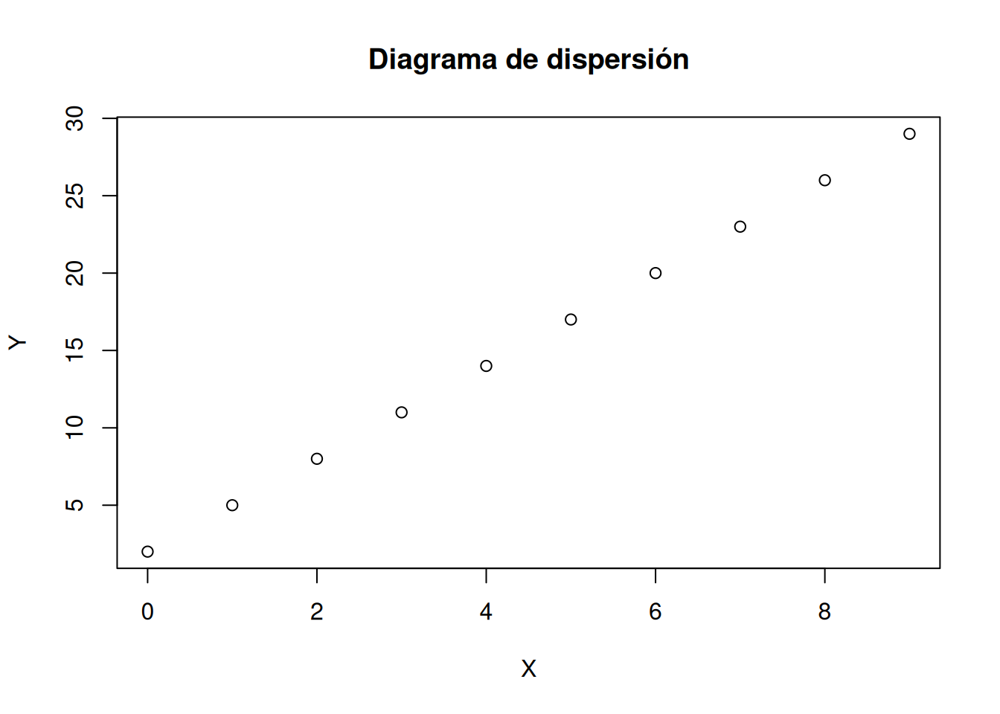{width=672}
    :::
    :::

    :::

    :::{.callout-tip collapse="true"}
    ## Solución 2

    Otra alternativa es usar la función la función [`geom_point`](https://aprendeconalf.es/manual-r/07-graficos.html#diagramas-de-puntos) del paquete `ggplot2`.


    ::: {.cell hash='05-regresion_cache/html/unnamed-chunk-3_a267c464d4afee84a46f7bf7f0a81c20'}
    
    ```{.r .cell-code}
    library(ggplot2)
    ggplot(df, aes(x = x, y = y)) +
        geom_point(col = "red") +
        labs(title = "Diagrama de dispersión", x = "X", y = "Y")
    ```
    
    ::: {.cell-output-display}
    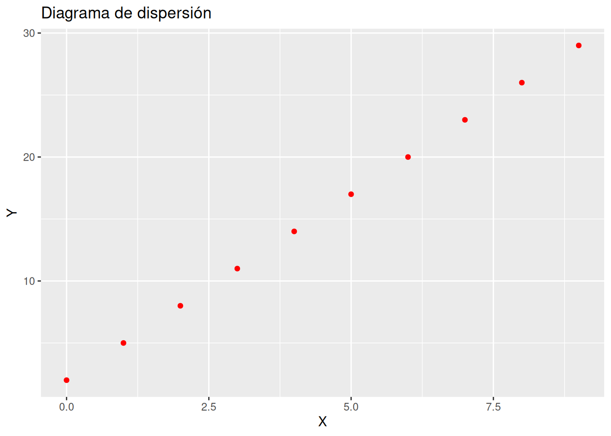{width=672}
    :::
    :::


    El tipo de modelo que mejor se ajusta es lineal, ya que todos los puntos están alineados.
    :::

a.  Calcular la recta de regresión de $Y$ sobre $X$.

    ::: {.callout-tip collapse="true"}
    ## Solución

    Para ajustar un modelo de regresión se utiliza la función [`lm`](https://www.rdocumentation.org/packages/stats/versions/3.6.2/topics/lm) del paquete `stats`. Esta función requiere que se le pase como parámetro la fórmula del modelo de regresión que debe tener la sintaxis `y ~ f(x)`, donde `y` es la variable dependiente en el modelo, `x` es la variable independiente, y `f(x)` es una expresión matemática que describe el modelo.


    ::: {.cell hash='05-regresion_cache/html/unnamed-chunk-4_3a0f4e4a58cdeeed627f9b3fa730df7e'}
    
    ```{.r .cell-code}
    recta_y_x <- lm(y ~ x, df) 
    summary(recta_y_x)
    ```
    
    ::: {.cell-output .cell-output-stderr}
    ```
    Warning in summary.lm(recta_y_x): essentially perfect fit: summary may be
    unreliable
    ```
    :::
    
    ::: {.cell-output .cell-output-stdout}
    ```
    
    Call:
    lm(formula = y ~ x, data = df)
    
    Residuals:
           Min         1Q     Median         3Q        Max 
    -3.675e-15 -8.783e-16  5.168e-16  9.646e-16  1.944e-15 
    
    Coefficients:
                 Estimate Std. Error   t value Pr(>|t|)    
    (Intercept) 2.000e+00  1.049e-15 1.906e+15   <2e-16 ***
    x           3.000e+00  1.965e-16 1.527e+16   <2e-16 ***
    ---
    Signif. codes:  0 '***' 0.001 '**' 0.01 '*' 0.05 '.' 0.1 ' ' 1
    
    Residual standard error: 1.785e-15 on 8 degrees of freedom
    Multiple R-squared:      1,	Adjusted R-squared:      1 
    F-statistic: 2.33e+32 on 1 and 8 DF,  p-value: < 2.2e-16
    ```
    :::
    :::


    La recta de regresión de $Y$ sobre $X$ es $y = 2 + 3 x$.
    :::

a.  Obtener el coeficiente de regresión de la recta anterior e interpretarlo.

    ::: {.callout-tip collapse="true"}
    ## Solución

    El coeficiente de regresión es la pendiente de la recta de regresión


    ::: {.cell hash='05-regresion_cache/html/unnamed-chunk-5_6b5ed59f5600c3f6562b11598431364e'}
    
    ```{.r .cell-code}
    cat(paste("Coeficiente de regresión de Y sobre X:", recta_y_x$coefficients[["x"]]))
    ```
    
    ::: {.cell-output .cell-output-stdout}
    ```
    Coeficiente de regresión de Y sobre X: 3
    ```
    :::
    :::


    El coeficiente de regresión de $Y$ sobre $X$ vale 3, lo que indica que $Y$ aumenta 3 unidades por cada unidad que aumenta $X$.
    :::

a.  Dibujar la recta de regresión de $Y$ sobre $X$ sobre el diagrama de dispersión. ¿Cómo son los residuos del modelo de regresión?


    ::: {.callout-tip collapse="true"}
    ## Solución 1

    Para dibujar la recta de regresión se puede usar la función [`abline`](https://www.rdocumentation.org/packages/graphics/versions/3.6.2/topics/abline) del paquete `graphics`.
    

    ::: {.cell hash='05-regresion_cache/html/unnamed-chunk-6_4510a8bb7dc261b82f8c7e8621262ad0'}
    
    ```{.r .cell-code}
    plot(df$x, df$y, xlab = "X", ylab = "Y", main = "Diagrama de dispersión")
    abline(recta_y_x)
    ```
    
    ::: {.cell-output-display}
    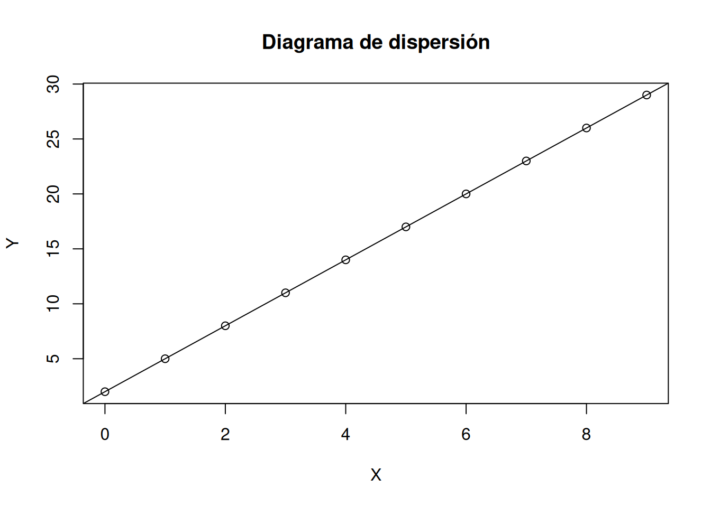{width=672}
    :::
    :::

    :::

    :::{.callout-tip collapse="true"}
    ## Solución 2

    Otra alternativa es usar la geometría de ajuste de regresión por mínimos cuadrados [`geom_smooth`](https://aprendeconalf.es/manual-r/07-graficos.html#interpolaci%C3%B3n-y-ajustes-de-regresi%C3%B3n) del paquete `ggplot2`.


    ::: {.cell hash='05-regresion_cache/html/unnamed-chunk-7_38af4206843d55169c3acd607b14e396'}
    
    ```{.r .cell-code}
    library(ggplot2)
    ggplot(df, aes(x = x, y = y)) +
        geom_point(col = "red") +
        geom_smooth(method = "lm") +
        labs(title = "Diagrama de dispersión", x = "X", y = "Y")
    ```
    
    ::: {.cell-output .cell-output-stderr}
    ```
    `geom_smooth()` using formula = 'y ~ x'
    ```
    :::
    
    ::: {.cell-output-display}
    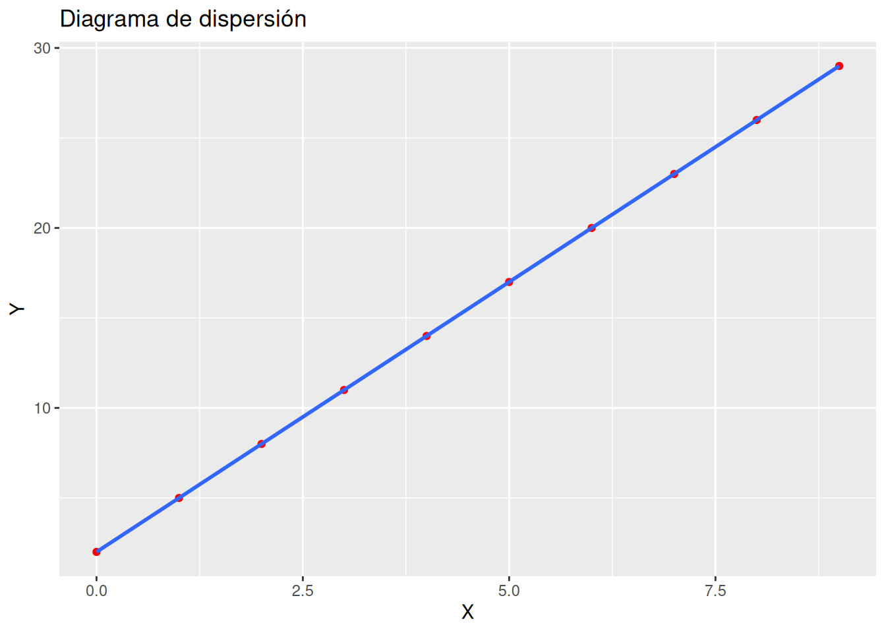{width=672}
    :::
    :::


    Como la recta pasa por todos los puntos del diagrama de dispersión, los residuos son nulos.
    :::

a.  Calcular el coeficiente de determinación del modelo lineal e interpretarlo.

    ::: {.callout-tip collapse="true"}
    ## Solución


    ::: {.cell hash='05-regresion_cache/html/unnamed-chunk-8_620f695321a60a62791604d467e61b1a'}
    
    ```{.r .cell-code}
    cat(paste("Coeficiente de determinación lineal R²:", summary(recta_y_x)$r.squared))
    ```
    
    ::: {.cell-output .cell-output-stderr}
    ```
    Warning in summary.lm(recta_y_x): essentially perfect fit: summary may be
    unreliable
    ```
    :::
    
    ::: {.cell-output .cell-output-stdout}
    ```
    Coeficiente de determinación lineal R²: 1
    ```
    :::
    :::


    Como el coeficiente de determinación lineal vale 1, el ajuste de la recta de regresión es perfecto.
    :::

a.  Calcular la recta de regresión de $X$ sobre $Y$. ¿Coincide con la recta de regresión de $Y$ sobre $X$?

    ::: {.callout-tip collapse="true"}
    ## Solución


    ::: {.cell hash='05-regresion_cache/html/unnamed-chunk-9_c87776714b4ce3f68255a9e655237cf0'}
    
    ```{.r .cell-code}
    recta_x_y <- lm(x ~ y, df) 
    summary(recta_x_y)
    ```
    
    ::: {.cell-output .cell-output-stderr}
    ```
    Warning in summary.lm(recta_x_y): essentially perfect fit: summary may be
    unreliable
    ```
    :::
    
    ::: {.cell-output .cell-output-stdout}
    ```
    
    Call:
    lm(formula = x ~ y, data = df)
    
    Residuals:
           Min         1Q     Median         3Q        Max 
    -1.435e-15 -5.090e-16 -2.062e-17  3.798e-16  1.943e-15 
    
    Coefficients:
                  Estimate Std. Error    t value Pr(>|t|)    
    (Intercept) -6.667e-01  6.179e-16 -1.079e+15   <2e-16 ***
    y            3.333e-01  3.484e-17  9.567e+15   <2e-16 ***
    ---
    Signif. codes:  0 '***' 0.001 '**' 0.01 '*' 0.05 '.' 0.1 ' ' 1
    
    Residual standard error: 9.494e-16 on 8 degrees of freedom
    Multiple R-squared:      1,	Adjusted R-squared:      1 
    F-statistic: 9.153e+31 on 1 and 8 DF,  p-value: < 2.2e-16
    ```
    :::
    :::


    La recta de regresión de $X$ sobre $Y$ es $x = -0.6666667 + 0.3333333 x$, que es la misma que la recta de $Y$ sobre $X$, ya que el ajuste es perfecto, y tanto los residuos en $Y$ como los residuos en $X$ valen cero para esta recta.
    :::
:::

:::{#exr-regresion-2}
El fichero [`horas-estudio.csv`](datos/horas-estudio.csv) contiene información sobre las horas de estudio diarias de una muestra de alumnos de ingeniería, y el número de asignaturas suspendidas al final del curso.

a.  Crear un data frame con los datos de las horas de estudio y los suspensos a partir del fichero [`horas-estudio.csv`](https://aprendeconalf.es/estadistica-practicas-r/datos/horas-estudio.csv).

    :::{.callout-tip collapse="true"} 
    ## Solución


    ::: {.cell hash='05-regresion_cache/html/unnamed-chunk-10_1ec301d74ea777d5970a259766b0cb6b'}
    
    ```{.r .cell-code}
    library(readr)
    df <- read_csv("https://aprendeconalf.es/estadistica-practicas-r/datos/horas-estudio.csv")
    ```
    
    ::: {.cell-output .cell-output-stderr}
    ```
    Rows: 30 Columns: 2
    ── Column specification ────────────────────────────────────────────────────────
    Delimiter: ","
    dbl (2): Horas, Suspensos
    
    ℹ Use `spec()` to retrieve the full column specification for this data.
    ℹ Specify the column types or set `show_col_types = FALSE` to quiet this message.
    ```
    :::
    
    ```{.r .cell-code}
    df
    ```
    
    ::: {.cell-output .cell-output-stdout}
    ```
    # A tibble: 30 × 2
       Horas Suspensos
       <dbl>     <dbl>
     1   3.5         1
     2   0.6         5
     3   2.8         1
     4   2.5         3
     5   2.6         1
     6   3.9         0
     7   1.5         3
     8   0.7         3
     9   3.6         1
    10   3.7         1
    # ℹ 20 more rows
    ```
    :::
    :::

    :::

a.  Dibujar el diagrama de dispersión correspondiente. ¿Qué tipo de modelo de regresión se ajusta mejor a la nube de puntos?

    :::{.callout-tip collapse="true"}
    ## Solución 


    ::: {.cell hash='05-regresion_cache/html/unnamed-chunk-11_9640840bc1693d8ab6f4a24a2e9ac8c4'}
    
    ```{.r .cell-code}
    library(ggplot2)
    ggplot(df, aes(x = Horas, y = Suspensos)) +
        geom_point(col = "red") +
        labs(title = "Diagrama de dispersión", x = "Horas de estudio", y = "Asignaturas suspensas")
    ```
    
    ::: {.cell-output-display}
    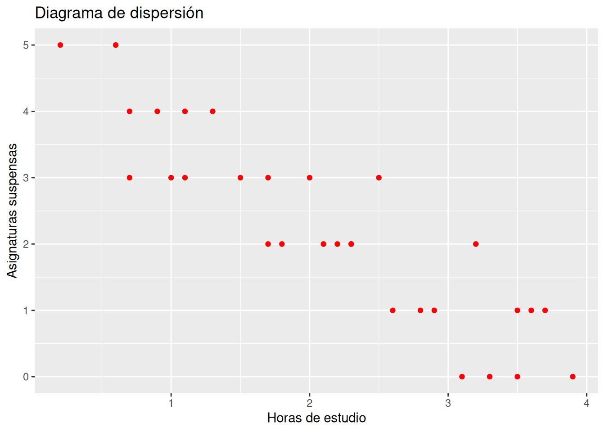{width=672}
    :::
    :::


    El tipo de modelo que mejor se ajusta es lineal, ya que hay una tendencia lineal en la nube de puntos y además es inversa.
    :::

a.  Calcular la recta de regresión de los suspensos sobre las horas de estudio.

    ::: {.callout-tip collapse="true"}
    ## Solución


    ::: {.cell hash='05-regresion_cache/html/unnamed-chunk-12_455cdb7a0b86c85ce7ab1523a9b97f7e'}
    
    ```{.r .cell-code}
    recta_suspensos_horas <- lm(Suspensos ~ Horas, df) 
    summary(recta_suspensos_horas)
    ```
    
    ::: {.cell-output .cell-output-stdout}
    ```
    
    Call:
    lm(formula = Suspensos ~ Horas, data = df)
    
    Residuals:
         Min       1Q   Median       3Q      Max 
    -1.03614 -0.53214 -0.02013  0.49187  1.22587 
    
    Coefficients:
                Estimate Std. Error t value Pr(>|t|)    
    (Intercept)   4.8491     0.2622   18.49  < 2e-16 ***
    Horas        -1.2300     0.1106  -11.12  8.7e-12 ***
    ---
    Signif. codes:  0 '***' 0.001 '**' 0.01 '*' 0.05 '.' 0.1 ' ' 1
    
    Residual standard error: 0.6359 on 28 degrees of freedom
    Multiple R-squared:  0.8155,	Adjusted R-squared:  0.8089 
    F-statistic: 123.8 on 1 and 28 DF,  p-value: 8.7e-12
    ```
    :::
    :::


    La recta de regresión de los suspensos sobre las horas es $\textsf{suspensos}= 4.8491273 + -1.2299972 \textsf{horas}$.
    :::

a.  Obtener el coeficiente de regresión de la recta anterior e interpretarlo.

    ::: {.callout-tip collapse="true"}
    ## Solución


    ::: {.cell hash='05-regresion_cache/html/unnamed-chunk-13_b90d677a9829e84faa1056d9d53fdf2e'}
    
    ```{.r .cell-code}
    cat(paste("Coeficiente de regresión de Suspensos sobre Horas:", recta_suspensos_horas$coefficients[["Horas"]]))
    ```
    
    ::: {.cell-output .cell-output-stdout}
    ```
    Coeficiente de regresión de Suspensos sobre Horas: -1.22999717844331
    ```
    :::
    :::


    El coeficiente de regresión de los suspensos sobre las horas de estudio vale  -1.2299972, lo que indica que por cada hora de estudio se obtendrán 1.2299972 suspensos menos al final del curso.
    :::

a.  Dibujar la recta de regresión  sobre el diagrama de dispersión. ¿El ajuste es mejor o peor que el del ejercicio anterior?


    :::{.callout-tip collapse="true"}
    ## Solución


    ::: {.cell hash='05-regresion_cache/html/unnamed-chunk-14_8d3b1f01a96ea4e12d0cdff3bb27c0c9'}
    
    ```{.r .cell-code}
    library(ggplot2)
    ggplot(df, aes(x = Horas, y = Suspensos)) +
        geom_point(col = "red") +
        geom_smooth(method = "lm") +
        labs(title = "Diagrama de dispersión", x = "Horas de estudio", y = "Asignaturas suspensas")
    ```
    
    ::: {.cell-output .cell-output-stderr}
    ```
    `geom_smooth()` using formula = 'y ~ x'
    ```
    :::
    
    ::: {.cell-output-display}
    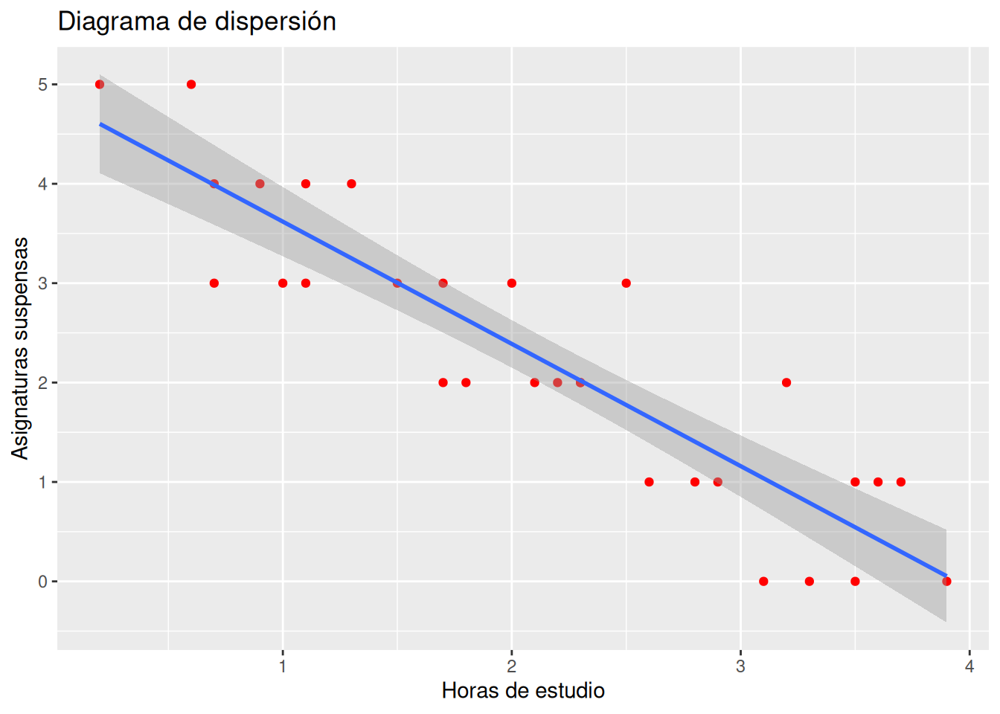{width=672}
    :::
    :::


    En este caso el ajuste no es perfecto, ya que es imposible que la recta pase por todos los puntos como ocurría en el ejercicio anterior. Por tanto, el ajuste es peor.
    :::

a.  Calcular el coeficiente de determinación del modelo lineal e interpretarlo.

    ::: {.callout-tip collapse="true"}
    ## Solución


    ::: {.cell hash='05-regresion_cache/html/unnamed-chunk-15_d1b9c8d37ccfe6e24f8c9f4776b6a412'}
    
    ```{.r .cell-code}
    cat(paste("Coeficiente de determinación lineal R²:", summary(recta_suspensos_horas)$r.squared))
    ```
    
    ::: {.cell-output .cell-output-stdout}
    ```
    Coeficiente de determinación lineal R²: 0.81549948723949
    ```
    :::
    :::


    Como el coeficiente de determinación lineal vale 0.8154995 que está bastante próximo a 1, el ajuste es bueno, y el modelo puede utilizarse con fines predictivos.
    :::

a.  Utilizar la recta de regresión para predecir el número de suspensos correspondiente a 3 horas de estudio diarias. ¿Es fiable esta predicción? 

    ::: {.callout-tip collapse="true"}
    ## Solución


    ::: {.cell hash='05-regresion_cache/html/unnamed-chunk-16_83db87809617aedd45136bfd8fc3e5f5'}
    
    ```{.r .cell-code}
    predict.lm(recta_suspensos_horas, newdata = list(Horas = 3))
    ```
    
    ::: {.cell-output .cell-output-stdout}
    ```
           1 
    1.159136 
    ```
    :::
    :::


    La predicción será fiable ya que el coeficiente de determinación está próximo a 1 y el tamaño de la muestra no es muy pequeño.
    :::

a.  Según el modelo lineal, ¿cuántas horas diarias tendrá que estudiar como mínimo un alumno si quiere aprobarlo todo?

    ::: {.callout-tip collapse="true"}
    ## Solución

    Como ahora queremos predecir el número de horas de estudio, necesitamos calcular la recta de regresión de la horas sobre los suspensos.


    ::: {.cell hash='05-regresion_cache/html/unnamed-chunk-17_6479f5944eca4d30ec6f797a8fdfed42'}
    
    ```{.r .cell-code}
    recta_horas_suspensos <- lm(Horas ~ Suspensos, df) 
    predict.lm(recta_horas_suspensos, newdata = list(Suspensos = 0))
    ```
    
    ::: {.cell-output .cell-output-stdout}
    ```
           1 
    3.607387 
    ```
    :::
    :::

    :::
:::

:::{#exr-regresion-3}
Después de tomar un litro de vino se ha medido la concentración de alcohol en la sangre en distintos instantes, obteniendo los siguientes datos

$$
\begin{array}{lrrrrrrr}
\hline 
\mbox{Tiempo después (minutos)} & 30 & 60 & 90 & 120 & 150 & 180 & 210\\ 
\mbox{Alcohol (gramos/litro)} & 1.6 & 1.7 & 1.5 & 1.1 & 0.7 & 0.2 & 2.1\\
\hline
\end{array}
$$

a.  Crear un data frame con los datos del tiempo y la concentración de alcohol.

    ::: {.callout-tip collapse="true"}
    ## Solución


    ::: {.cell hash='05-regresion_cache/html/unnamed-chunk-18_842fdd19f358269bf9aac1c822f592d3'}
    
    ```{.r .cell-code}
    df <- data.frame(
        Tiempo = c(30, 60, 90, 120, 150, 180, 210),
        Alcohol = c(1.6, 1.7, 1.5, 1.1, 0.7, 0.2, 2.1)
    )
    df
    ```
    
    ::: {.cell-output .cell-output-stdout}
    ```
      Tiempo Alcohol
    1     30     1.6
    2     60     1.7
    3     90     1.5
    4    120     1.1
    5    150     0.7
    6    180     0.2
    7    210     2.1
    ```
    :::
    :::

    :::

a.  Calcular el coeficiente de correlación lineal. ¿Existe relación lineal entre la concentración de alcohol y el tiempo que pasa?

    ::: {.callout-tip collapse="true"}
    ## Solución

    Para calcular el coeficiente de correlación lineal de Pearson se puede utilar la función [`cor`](https://www.rdocumentation.org/packages/stats/versions/3.6.2/topics/cor) del paquete `stats`.


    ::: {.cell hash='05-regresion_cache/html/unnamed-chunk-19_7e1b84ad292c89627a16d128e3211a41'}
    
    ```{.r .cell-code}
    cor(df$Tiempo, df$Alcohol)
    ```
    
    ::: {.cell-output .cell-output-stdout}
    ```
    [1] -0.2730367
    ```
    :::
    :::


    El valore del coeficiente de correlación lineal es muy bajo, por lo que aparentemente no hay relación lineal entre la concentración de alcohol en sangre y el tiempo que pasa.
    :::

a.  Dibujar el diagrama de dispersión correspondiente y la recta de regresión de la concentración de alcohol sobre el tiempo. ¿Por qué el ajuste es tan malo?

    :::{.callout-tip collapse="true"}
    ## Solución 


    ::: {.cell hash='05-regresion_cache/html/unnamed-chunk-20_4230874691faa756eb9e83563903e208'}
    
    ```{.r .cell-code}
    library(ggplot2)
    ggplot(df, aes(x = Tiempo, y = Alcohol)) +
        geom_point(col = "red") +
        geom_smooth(method = "lm") +
        labs(title = "Diagrama de dispersión", x = "Tiempo en minutos", y = "Concentración de alcohol en sangre (g/l)")
    ```
    
    ::: {.cell-output .cell-output-stderr}
    ```
    `geom_smooth()` using formula = 'y ~ x'
    ```
    :::
    
    ::: {.cell-output-display}
    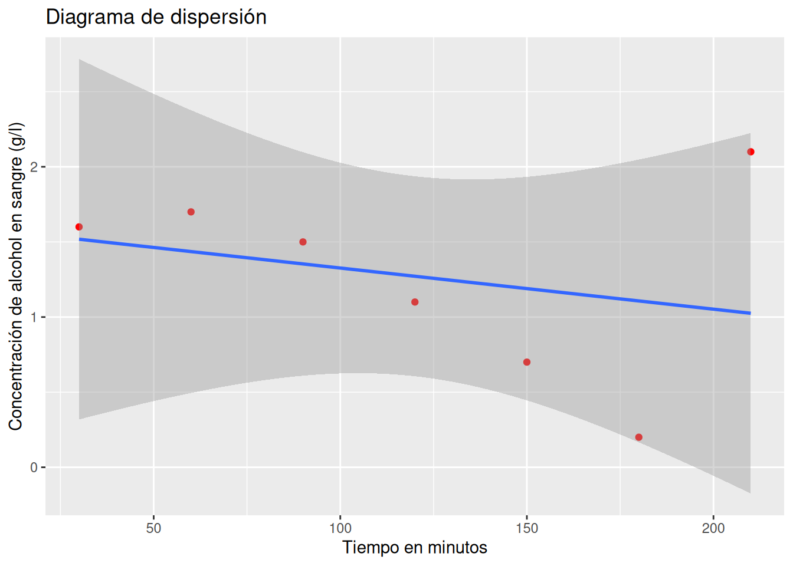{width=672}
    :::
    :::


    El ajuste es malo porque hay un dato atípico que no sigue la misma tendencia que el resto. 
    :::

a.  Eliminar el dato atípico y calcular la recta de la concentración de alcohol sobre el tiempo. ¿Ha mejorado el modelo?

    ::: {.callout-tip collapse="true"}
    ## Solución


    ::: {.cell hash='05-regresion_cache/html/unnamed-chunk-21_65fdce270b0aa9a81090f15eb0a64bb9'}
    
    ```{.r .cell-code}
    # Eliminamos el dato atípico que está en la fila 
    df <- df[-c(7), ]
    recta_alcohol_tiempo <- lm(Alcohol ~ Tiempo, df) 
    summary(recta_alcohol_tiempo)
    ```
    
    ::: {.cell-output .cell-output-stdout}
    ```
    
    Call:
    lm(formula = Alcohol ~ Tiempo, data = df)
    
    Residuals:
           1        2        3        4        5        6 
    -0.27619  0.12095  0.21810  0.11524  0.01238 -0.19048 
    
    Coefficients:
                 Estimate Std. Error t value Pr(>|t|)    
    (Intercept)  2.173333   0.201927  10.763 0.000423 ***
    Tiempo      -0.009905   0.001728  -5.731 0.004591 ** 
    ---
    Signif. codes:  0 '***' 0.001 '**' 0.01 '*' 0.05 '.' 0.1 ' ' 1
    
    Residual standard error: 0.2169 on 4 degrees of freedom
    Multiple R-squared:  0.8914,	Adjusted R-squared:  0.8643 
    F-statistic: 32.84 on 1 and 4 DF,  p-value: 0.004591
    ```
    :::
    :::


    La recta de regresión de la concentración de alcohol en sangre sobre el tiempo es $\textsf{alcohol}= 2.1733333 + -0.0099048 \textsf{tiempo}$.

    El modelo ha mejorado notablemente ya que ahora el coeficiente de determinación lineal $R^2=0.8914286$, que está muy próximo a 1.
    :::

a.  Según el modelo de regresión lineal, ¿a qué velocidad metaboliza esta persona el alcohol?

    ::: {.callout-tip collapse="true"}
    ## Solución


    ::: {.cell hash='05-regresion_cache/html/unnamed-chunk-22_567d48101caf488757655f14cf0b15df'}
    
    ```{.r .cell-code}
    cat(paste("Coeficiente de regresión de la concentración de alchol sobre el tiempo:", recta_alcohol_tiempo$coefficients[["Tiempo"]]))
    ```
    
    ::: {.cell-output .cell-output-stdout}
    ```
    Coeficiente de regresión de la concentración de alchol sobre el tiempo: -0.00990476190476191
    ```
    :::
    :::


    Así pues, la velocidad de metabolización del alcohol es 0.0099048 g/l$\cdot$min.
    :::

a.  Si la concentración máxima de alcohol en la sangre que permite la ley para poder conducir es $0.3$ g/l, ¿cuánto tiempo habrá que esperar después de tomarse un litro de vino para poder conducir sin infringir la ley? ¿Es fiable esta predicción?

    ::: {.callout-tip collapse="true"}
    ## Solución

    Como ahora queremos predecir el tiempo, necesitamos calcular la recta de regresión del tiempo sobre la concentración de alcohol.


    ::: {.cell hash='05-regresion_cache/html/unnamed-chunk-23_46bca3be9afceda0d2cebc73267d2e08'}
    
    ```{.r .cell-code}
    recta_tiempo_alcohol <- lm(Tiempo ~ Alcohol, df) 
    predict.lm(recta_tiempo_alcohol, newdata = list(Alcohol = 0.3))
    ```
    
    ::: {.cell-output .cell-output-stdout}
    ```
      1 
    180 
    ```
    :::
    :::


    Aunque el coeficiente de determinación lineal está próximo a 1, el tamaño muestral es demasiado pequeño para que la predicción sea fiable.
    :::
:::

:::{#exr-regresion-4}
El fichero [`pib-usa.csv`](datos/pib-usa.csv) contiene información sobre el producto interior bruto de Estados Unidos en billones de dólares americanos desde 1947 hasta 2022.

a.  Crear un data frame con los datos del PIB y los años a partir del fichero [`pib-usa.csv`](https://aprendeconalf.es/estadistica-practicas-r/datos/horas-estudio.csv).

    :::{.callout-tip collapse="true"} 
    ## Solución


    ::: {.cell hash='05-regresion_cache/html/unnamed-chunk-24_10251a8f535e24099a6f5567a40fe809'}
    
    ```{.r .cell-code}
    library(readr)
    df <- read_csv("https://aprendeconalf.es/estadistica-practicas-r/datos/pib-usa.csv")
    ```
    
    ::: {.cell-output .cell-output-stderr}
    ```
    Rows: 76 Columns: 2
    ── Column specification ────────────────────────────────────────────────────────
    Delimiter: ","
    dbl (2): Año, PIB
    
    ℹ Use `spec()` to retrieve the full column specification for this data.
    ℹ Specify the column types or set `show_col_types = FALSE` to quiet this message.
    ```
    :::
    
    ```{.r .cell-code}
    df
    ```
    
    ::: {.cell-output .cell-output-stdout}
    ```
    # A tibble: 76 × 2
         Año   PIB
       <dbl> <dbl>
     1  1947  244.
     2  1948  267.
     3  1949  276.
     4  1950  282.
     5  1951  338.
     6  1952  362.
     7  1953  390.
     8  1954  387.
     9  1955  415.
    10  1956  443.
    # ℹ 66 more rows
    ```
    :::
    :::

    :::

a.  Dibujar el diagrama de dispersión que represente la evolución anual del PIB. ¿Qué tipo de modelo de regresión se ajusta mejor a la nube de puntos?

    :::{.callout-tip collapse="true"}
    ## Solución 


    ::: {.cell hash='05-regresion_cache/html/unnamed-chunk-25_d69a8725b7bce7d68c08a0dd97542f32'}
    
    ```{.r .cell-code}
    library(ggplot2)
    ggplot(df, aes(x = Año, y = PIB)) +
        geom_point(col = "red") +
        labs(title = "Evolución del PIB de Estados Unidos", x = "Año", y = "PIB en billones dólares")
    ```
    
    ::: {.cell-output-display}
    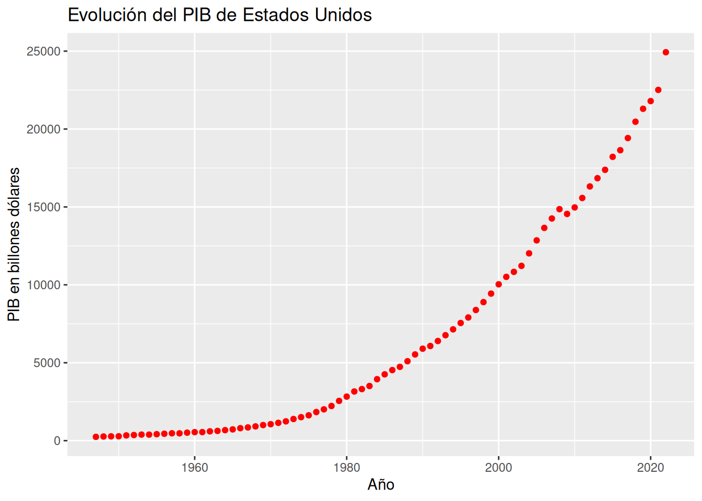{width=672}
    :::
    :::


    A la vista de la forma de la nube de puntos parece que la evolución del PIB es exponencial.
    :::

a.  Dibujar el diagrama de dispersión del logaritmo del PIB y los años.

    :::{.callout-tip collapse="true"}
    ## Solución 


    ::: {.cell hash='05-regresion_cache/html/unnamed-chunk-26_4160380ed8b967f23f19f6c09255328c'}
    
    ```{.r .cell-code}
    library(dplyr)
    ```
    
    ::: {.cell-output .cell-output-stderr}
    ```
    
    Attaching package: 'dplyr'
    ```
    :::
    
    ::: {.cell-output .cell-output-stderr}
    ```
    The following objects are masked from 'package:stats':
    
        filter, lag
    ```
    :::
    
    ::: {.cell-output .cell-output-stderr}
    ```
    The following objects are masked from 'package:base':
    
        intersect, setdiff, setequal, union
    ```
    :::
    
    ```{.r .cell-code}
    df <- mutate(df, logPIB = log(PIB)) 
    ggplot(df, aes(x = Año, y = logPIB)) +
            geom_point(col = "red") +
            labs(title = "Evolución del PIB de Estados Unidos", x = "Año", y = "Logaritmo del PIB en billones dólares")
    ```
    
    ::: {.cell-output-display}
    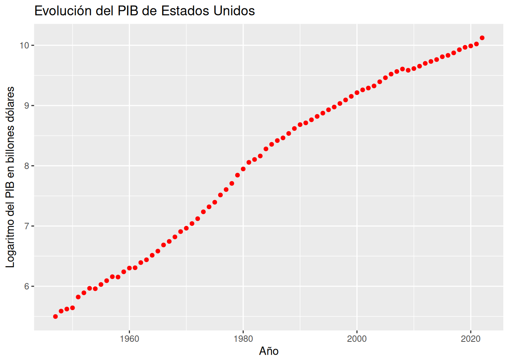{width=672}
    :::
    :::


    La nube de puntos tienen una clara forma lineal, lo que confirma que la evolución del PIB es exponencial.
    :::

a.  Calcular el modelo de regresión exponencial del PIB sobre los años.

    ::: {.callout-tip collapse="true"}
    ## Solución


    ::: {.cell hash='05-regresion_cache/html/unnamed-chunk-27_807ee49b656be8a7363ded9ff86dd027'}
    
    ```{.r .cell-code}
    recta_logPIB_años <- lm(log(PIB) ~ Año, df) 
    summary(recta_logPIB_años)
    ```
    
    ::: {.cell-output .cell-output-stdout}
    ```
    
    Call:
    lm(formula = log(PIB) ~ Año, data = df)
    
    Residuals:
         Min       1Q   Median       3Q      Max 
    -0.39115 -0.13495 -0.03532  0.17693  0.29436 
    
    Coefficients:
                  Estimate Std. Error t value Pr(>|t|)    
    (Intercept) -1.215e+02  1.951e+00  -62.27   <2e-16 ***
    Año          6.527e-02  9.832e-04   66.39   <2e-16 ***
    ---
    Signif. codes:  0 '***' 0.001 '**' 0.01 '*' 0.05 '.' 0.1 ' ' 1
    
    Residual standard error: 0.188 on 74 degrees of freedom
    Multiple R-squared:  0.9835,	Adjusted R-squared:  0.9833 
    F-statistic:  4407 on 1 and 74 DF,  p-value: < 2.2e-16
    ```
    :::
    :::


    El modelo de regresión exponencial que mejor explica la evolución del PIB es $\textsf{PIB}= e^{-121.4998223 + 0.065271 \textsf{Año}}$.
    :::

a.  ¿Cuál es la tasa de crecimiento porcentual anual del PIB?

    ::: {.callout-tip collapse="true"}
    ## Solución


    ::: {.cell hash='05-regresion_cache/html/unnamed-chunk-28_37b5ef0d629d494181bf6318026f3e30'}
    
    ```{.r .cell-code}
    cat(paste("Coeficiente de regresión del logaritmo del PIB sobre los años:", recta_logPIB_años$coefficients[["Año"]]))
    ```
    
    ::: {.cell-output .cell-output-stdout}
    ```
    Coeficiente de regresión del logaritmo del PIB sobre los años: 0.0652710244896027
    ```
    :::
    :::


    El coeficiente de regresión de los suspensos sobre las horas de estudio vale  0.065271, lo que indica que la tasa de crecimiento anual del PIB es 6.5271024%.
    :::

a.  Dibujar el modelo de regresión exponencial sobre el diagrama de dispersión.


    :::{.callout-tip collapse="true"}
    ## Solución


    ::: {.cell hash='05-regresion_cache/html/unnamed-chunk-29_42730dda66fdf2586a53d20259254683'}
    
    ```{.r .cell-code}
    library(ggplot2)
    ggplot(df, aes(x = Año, y = PIB)) +
            geom_point(col = "red") +
            geom_smooth(method = "glm", method.args = list(family=gaussian(link="log")))
    ```
    
    ::: {.cell-output .cell-output-stderr}
    ```
    `geom_smooth()` using formula = 'y ~ x'
    ```
    :::
    
    ::: {.cell-output-display}
    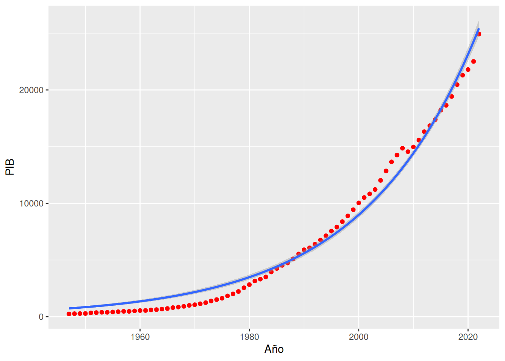{width=672}
    :::
    
    ```{.r .cell-code}
            labs(title = "Evolución del PIB de Estados Unidos", x = "Año", y = "Logaritmo del PIB en billones dólares")
    ```
    
    ::: {.cell-output .cell-output-stdout}
    ```
    $x
    [1] "Año"
    
    $y
    [1] "Logaritmo del PIB en billones dólares"
    
    $title
    [1] "Evolución del PIB de Estados Unidos"
    
    attr(,"class")
    [1] "labels"
    ```
    :::
    :::


    En este caso el ajuste no es perfecto, ya que es imposible que la recta pase por todos los puntos como ocurría en el ejercicio anterior. Por tanto, el ajuste es peor.
    :::


a.  ¿Es el modelo de regresión exponencial un buen modelo para explicar la evolución del PIB?

    ::: {.callout-tip collapse="true"}
    ## Solución


    ::: {.cell hash='05-regresion_cache/html/unnamed-chunk-30_488687e571755710ff67a81a7d97c807'}
    
    ```{.r .cell-code}
    cat(paste("Coeficiente de determinación exponencial R²:", summary(recta_logPIB_años)$r.squared))
    ```
    
    ::: {.cell-output .cell-output-stdout}
    ```
    Coeficiente de determinación exponencial R²: 0.983487569858149
    ```
    :::
    :::


    Como el coeficiente de determinación lineal vale 0.9834876 que está bastante próximo a 1, el ajuste es bueno, y el modelo exponencial explica muy bien la evolución del PIB.
    :::

a.  Utilizar el modelo de regresión exponencial para predecir el PIB del año 2024. ¿Es fiable esta predicción? 

    ::: {.callout-tip collapse="true"}
    ## Solución


    ::: {.cell hash='05-regresion_cache/html/unnamed-chunk-31_fceec52aa1986c2babf346cad76b8025'}
    
    ```{.r .cell-code}
    # El modelo exponencial devuelve el logaritmo del PIB, por lo que hay que aplicar la función exponencial para obtener el PIB.
    exp(predict.lm(recta_logPIB_años, newdata = list(Año = 2024)))
    ```
    
    ::: {.cell-output .cell-output-stdout}
    ```
          1 
    40486.8 
    ```
    :::
    :::


    La predicción será fiable ya que el coeficiente de determinación está próximo a 1, el tamaño de la muestra no es muy pequeño y el año para el que se realiza la predicción no está lejos del rango de años de la muestra.
    :::

a.  ¿Cuándo se alcanzará un PIB de 50000 billones de dólares?

    ::: {.callout-tip collapse="true"}
    ## Solución

    Como ahora queremos predecir el año en el que se alcanzará el PIB dado, necesitamos construir el modelo de regresión de los años sobre el PIB. Como la relación entre el PIB y los años es exponencial, la relación entre los años y el PIB será la inversa, es decir, el modelo logarítmico.


    ::: {.cell hash='05-regresion_cache/html/unnamed-chunk-32_b0589dc440b0a9efce0552fdcfea0cc9'}
    
    ```{.r .cell-code}
    log_años_PIB <- lm(Año ~ log(PIB), df) 
    summary(log_años_PIB)
    ```
    
    ::: {.cell-output .cell-output-stdout}
    ```
    
    Call:
    lm(formula = Año ~ log(PIB), data = df)
    
    Residuals:
        Min      1Q  Median      3Q     Max 
    -4.4049 -2.5367  0.2662  1.7718  6.4965 
    
    Coefficients:
                Estimate Std. Error t value Pr(>|t|)    
    (Intercept) 1863.498      1.852 1006.29   <2e-16 ***
    log(PIB)      15.068      0.227   66.39   <2e-16 ***
    ---
    Signif. codes:  0 '***' 0.001 '**' 0.01 '*' 0.05 '.' 0.1 ' ' 1
    
    Residual standard error: 2.857 on 74 degrees of freedom
    Multiple R-squared:  0.9835,	Adjusted R-squared:  0.9833 
    F-statistic:  4407 on 1 and 74 DF,  p-value: < 2.2e-16
    ```
    :::
    :::


    El modelo de regresión logarítmico de los años sobre el PIB es $\textsf{Año}= 1863.4980331 + 15.0677514 \log(\textsf{PIB})$.


    ::: {.cell hash='05-regresion_cache/html/unnamed-chunk-33_35c2b5a9ea36ebc95b86444735939906'}
    
    ```{.r .cell-code}
    predict.lm(log_años_PIB, newdata = list(PIB = 50000))
    ```
    
    ::: {.cell-output .cell-output-stdout}
    ```
           1 
    2026.528 
    ```
    :::
    :::

    :::
:::

:::{#exr-regresion-5}
El fichero [`dieta.csv`](datos/dieta.csv) contiene información sobre el los kilos perdidos con una dieta de adelgazamiento.

a.  Crear un data frame con los datos de la dieta a partir del fichero [`dieta.csv`](https://aprendeconalf.es/estadistica-practicas-r/datos/dieta.csv).

    :::{.callout-tip collapse="true"} 
    ## Solución


    ::: {.cell hash='05-regresion_cache/html/unnamed-chunk-34_c9481bc4dada041efbfec44b8a8e5b79'}
    
    ```{.r .cell-code}
    library(readr)
    df <- read_csv("https://aprendeconalf.es/estadistica-practicas-r/datos/dieta.csv")
    ```
    
    ::: {.cell-output .cell-output-stderr}
    ```
    Rows: 40 Columns: 3
    ── Column specification ────────────────────────────────────────────────────────
    Delimiter: ","
    chr (1): ejercicio
    dbl (2): dias, peso.perdido
    
    ℹ Use `spec()` to retrieve the full column specification for this data.
    ℹ Specify the column types or set `show_col_types = FALSE` to quiet this message.
    ```
    :::
    
    ```{.r .cell-code}
    df
    ```
    
    ::: {.cell-output .cell-output-stdout}
    ```
    # A tibble: 40 × 3
        dias peso.perdido ejercicio
       <dbl>        <dbl> <chr>    
     1    14         2.95 no       
     2    18         5.65 no       
     3    22         6.56 no       
     4    26         3.56 no       
     5    30         6.17 no       
     6    34         9.4  no       
     7    38        12.4  no       
     8    42        12.9  no       
     9    46        13.9  no       
    10    50        10.8  no       
    # ℹ 30 more rows
    ```
    :::
    :::

    :::

a.  Dibujar el diagrama de dispersión de los kilos perdidos en función del número de días con la dieta. ¿Qué tipo de modelo de regresión se ajusta mejor a la nube de puntos?

    :::{.callout-tip collapse="true"}
    ## Solución 


    ::: {.cell hash='05-regresion_cache/html/unnamed-chunk-35_96ff5d0898aa080b95b0e582facae629'}
    
    ```{.r .cell-code}
    library(ggplot2)
    ggplot(df, aes(x = dias, y = peso.perdido)) +
        geom_point(col = "red") +
        labs(title = "Diagrama de dispersión del peso perdido y los días de dieta", x = "Días de dieta", y = "Peso perdido en Kg")
    ```
    
    ::: {.cell-output-display}
    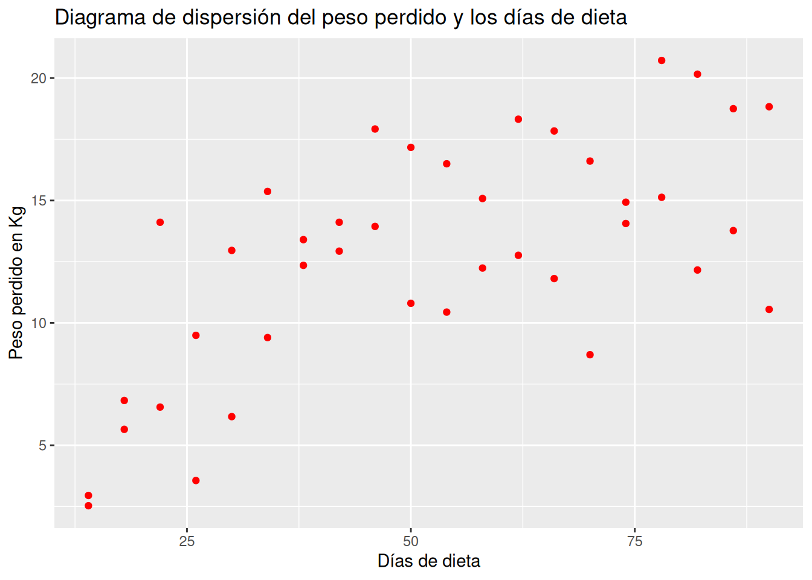{width=672}
    :::
    :::


    La nube de puntos es bastante difusa aunque parece apreciarse una tendencia logarítmica o sigmoidal.
    :::

a.  Calcular los coeficientes de determinación lineal, cuadrático, exponencial, logarítmico, potencial, inverso y sigmoidal. ¿Qué tipo de modelo explica mejor la relación entre los kilos perdidos y el número de días de dieta? ¿Qué porcentaje de la variabilidad de peso perdido explica el mejor modelo de regresión?

    ::: {.callout-tip collapse="true"}
    ## Solución


    ::: {.cell hash='05-regresion_cache/html/unnamed-chunk-36_68b0d855cf61165474d3dcc237cb70f5'}
    
    ```{.r .cell-code}
    library(dplyr)
    library(tidyr)
    library(purrr)
    library(broom)
    library(kableExtra)
    # Construimos un data frame con el ajuste de los modelos.
    modelos <- tibble(
            Lineal = list(lm(peso.perdido ~ dias, df)),
            Cuadratico = list(lm(peso.perdido ~ dias + I(dias^2), df)),
            Exponencial = list(lm(log(peso.perdido) ~ dias, df)),
            Logaritmico = list(lm(peso.perdido ~ log(dias), df)),
            Potencial = list(lm(log(peso.perdido) ~ log(dias), df)),
            Inverso = list(lm(peso.perdido ~ I(1/dias), df)),
            Sigmoidal = list(lm(log(peso.perdido) ~ I(1/dias), df)),
        )  %>% 
        # 
        # Reestructuramos el data frame para tener todos los modelos en la misma columna.
        pivot_longer(everything(), names_to = "Tipo_Modelo", values_to = "Modelo")  %>% 
        # Obtenemos un resumen del ajuste de cada modelo en formato organizado (se obtiene una lista con los parámetros que describen el ajuste de cada modelo).
        mutate(Resumen = map(Modelo, glance)) %>% 
        # Desanidamos el resumen (se obtiene una columna para cada parámetro del resumen del ajuste de los modelos).
        unnest(Resumen)  %>% 
        # Ordenamos el data frame por el coeficiente de determinación.
        arrange(-r.squared)
    modelos  %>%
        select(Tipo_Modelo, r.squared)  %>% 
        kable(col.names = c("Tipo de Modelo", "R²")) %>%
        kable_styling(full_width = F)
    ```
    
    ::: {.cell-output-display}

    `````{=html}
    <table class="table" style="width: auto !important; margin-left: auto; margin-right: auto;">
     <thead>
      <tr>
       <th style="text-align:left;"> Tipo de Modelo </th>
       <th style="text-align:right;"> R² </th>
      </tr>
     </thead>
    <tbody>
      <tr>
       <td style="text-align:left;"> Sigmoidal </td>
       <td style="text-align:right;"> 0.6662170 </td>
      </tr>
      <tr>
       <td style="text-align:left;"> Potencial </td>
       <td style="text-align:right;"> 0.5684490 </td>
      </tr>
      <tr>
       <td style="text-align:left;"> Inverso </td>
       <td style="text-align:right;"> 0.5583853 </td>
      </tr>
      <tr>
       <td style="text-align:left;"> Cuadratico </td>
       <td style="text-align:right;"> 0.5397848 </td>
      </tr>
      <tr>
       <td style="text-align:left;"> Logaritmico </td>
       <td style="text-align:right;"> 0.5254856 </td>
      </tr>
      <tr>
       <td style="text-align:left;"> Lineal </td>
       <td style="text-align:right;"> 0.4356390 </td>
      </tr>
      <tr>
       <td style="text-align:left;"> Exponencial </td>
       <td style="text-align:right;"> 0.4308936 </td>
      </tr>
    </tbody>
    </table>
    
    `````

    :::
    :::


    El mejor modelo es el Sigmoidal que explica el 66.6216965% de la variabilidad del peso perdido. 
    :::

a.  Dibujar el diagrama de dispersión de los kilos perdidos en función del número de días con la dieta según si la persona hace ejercicio o no. ¿Qué conclusiones se pueden sacar?

    :::{.callout-tip collapse="true"}
    ## Solución 


    ::: {.cell hash='05-regresion_cache/html/unnamed-chunk-37_51fcd669e5a64ca7f5aa7eef944669c6'}
    
    ```{.r .cell-code}
    library(ggplot2)
    ggplot(df, aes(x = dias, y = peso.perdido, color = ejercicio)) +
        geom_point() +
        labs(title = "Diagrama de dispersión del peso perdido y los días de dieta", x = "Días de dieta", y = "Peso perdido en Kg")
    ```
    
    ::: {.cell-output-display}
    {width=672}
    :::
    :::


    Claramente la nube de puntos de las personas que hacen ejercicio está por encima de la de los que no hacen ejercicio, lo que indica que hacer ejercicio favorece la pérdida de peso. Los más razonable es construir modelos de regresión para cada grupo.
    :::

a.  ¿Qué tipo de modelo explica mejor la relación entre el peso perdido y los días de dieta en el grupo de las personas que hacen ejercicio? ¿Y en el grupo de las que no hacen ejercicio? ¿Han mejorado los modelos con respecto al modelo anterior?

    ::: {.callout-tip collapse="true"}
    ## Solución


    ::: {.cell hash='05-regresion_cache/html/unnamed-chunk-38_97ced36e24115dc3138ab7b148f76da7'}
    
    ```{.r .cell-code}
    modelos <- df  %>% 
        # Anidamos por la columna ejercicio.
        nest_by(ejercicio)  %>% 
        # Ajustamos los modelos de regresión.
        mutate(
            Lineal = list(lm(peso.perdido ~ dias, data)),
            Cuadratico = list(lm(peso.perdido ~ dias + I(dias^2), data)),
            Exponencial = list(lm(log(peso.perdido) ~ dias, data)),
            Logaritmico = list(lm(peso.perdido ~ log(dias), data)),
            Potencial = list(lm(log(peso.perdido) ~ log(dias), data)),
            Inverso = list(lm(peso.perdido ~ I(1/dias), data)),
            Sigmoidal = list(lm(log(peso.perdido) ~ I(1/dias), data)),
        )  %>% 
        # Reestructuramos el data frame para tener todos los modelos en la misma columna.
        pivot_longer(-c(ejercicio, data), names_to = "Tipo_Modelo", values_to = "Modelo")  %>% 
        # Obtenemos un resumen del ajuste de cada modelo en formato organizado (se obtiene una lista con los parámetros que describen el ajuste de cada modelo).
        mutate(Resumen = map(Modelo, glance)) %>% 
        # Desanidamos el resumen (se obtiene una columna para cada parámetro del resumen del ajuste de los modelos).
        unnest(Resumen)  %>% 
        # Ordenamos el data frame por la columna ejercicio y por el coeficiente de determinación.
        arrange(ejercicio, -r.squared)  
    modelos %>% 
        select(ejercicio, Tipo_Modelo, r.squared)  %>% 
        kable(col.names = c("Ejercicio", "Tipo de Modelo", "R²")) %>%
        pack_rows(index = table(modelos$ejercicio))  %>% 
        kable_styling(full_width = F)
    ```
    
    ::: {.cell-output-display}

    `````{=html}
    <table class="table" style="width: auto !important; margin-left: auto; margin-right: auto;">
     <thead>
      <tr>
       <th style="text-align:left;"> Ejercicio </th>
       <th style="text-align:left;"> Tipo de Modelo </th>
       <th style="text-align:right;"> R² </th>
      </tr>
     </thead>
    <tbody>
      <tr grouplength="7"><td colspan="3" style="border-bottom: 1px solid;"><strong>no</strong></td></tr>
    <tr>
       <td style="text-align:left;padding-left: 2em;" indentlevel="1"> no </td>
       <td style="text-align:left;"> Sigmoidal </td>
       <td style="text-align:right;"> 0.7401212 </td>
      </tr>
      <tr>
       <td style="text-align:left;padding-left: 2em;" indentlevel="1"> no </td>
       <td style="text-align:left;"> Cuadratico </td>
       <td style="text-align:right;"> 0.7100610 </td>
      </tr>
      <tr>
       <td style="text-align:left;padding-left: 2em;" indentlevel="1"> no </td>
       <td style="text-align:left;"> Inverso </td>
       <td style="text-align:right;"> 0.6796880 </td>
      </tr>
      <tr>
       <td style="text-align:left;padding-left: 2em;" indentlevel="1"> no </td>
       <td style="text-align:left;"> Potencial </td>
       <td style="text-align:right;"> 0.6700051 </td>
      </tr>
      <tr>
       <td style="text-align:left;padding-left: 2em;" indentlevel="1"> no </td>
       <td style="text-align:left;"> Logaritmico </td>
       <td style="text-align:right;"> 0.6494521 </td>
      </tr>
      <tr>
       <td style="text-align:left;padding-left: 2em;" indentlevel="1"> no </td>
       <td style="text-align:left;"> Lineal </td>
       <td style="text-align:right;"> 0.5286338 </td>
      </tr>
      <tr>
       <td style="text-align:left;padding-left: 2em;" indentlevel="1"> no </td>
       <td style="text-align:left;"> Exponencial </td>
       <td style="text-align:right;"> 0.5222832 </td>
      </tr>
      <tr grouplength="7"><td colspan="3" style="border-bottom: 1px solid;"><strong>si</strong></td></tr>
    <tr>
       <td style="text-align:left;padding-left: 2em;" indentlevel="1"> si </td>
       <td style="text-align:left;"> Inverso </td>
       <td style="text-align:right;"> 0.8470993 </td>
      </tr>
      <tr>
       <td style="text-align:left;padding-left: 2em;" indentlevel="1"> si </td>
       <td style="text-align:left;"> Sigmoidal </td>
       <td style="text-align:right;"> 0.8305013 </td>
      </tr>
      <tr>
       <td style="text-align:left;padding-left: 2em;" indentlevel="1"> si </td>
       <td style="text-align:left;"> Logaritmico </td>
       <td style="text-align:right;"> 0.7885173 </td>
      </tr>
      <tr>
       <td style="text-align:left;padding-left: 2em;" indentlevel="1"> si </td>
       <td style="text-align:left;"> Cuadratico </td>
       <td style="text-align:right;"> 0.7791671 </td>
      </tr>
      <tr>
       <td style="text-align:left;padding-left: 2em;" indentlevel="1"> si </td>
       <td style="text-align:left;"> Potencial </td>
       <td style="text-align:right;"> 0.6704843 </td>
      </tr>
      <tr>
       <td style="text-align:left;padding-left: 2em;" indentlevel="1"> si </td>
       <td style="text-align:left;"> Lineal </td>
       <td style="text-align:right;"> 0.6623502 </td>
      </tr>
      <tr>
       <td style="text-align:left;padding-left: 2em;" indentlevel="1"> si </td>
       <td style="text-align:left;"> Exponencial </td>
       <td style="text-align:right;"> 0.4945564 </td>
      </tr>
    </tbody>
    </table>
    
    `````

    :::
    :::


    El mejor modelo en el grupo de los que hacen ejercicio es el inverso y en el grupo de los que no el sigmoidal. Los modelos han mejorado bastante con respecto al modelo anterior, sobre todo el del grupo de personas que hace ejercicio.
    :::

a.  Construir el mejor modelo de regresión del peso perdido sobre los días de dieta para el grupo de las personas que hacen ejercicio y para el grupo de las que no.

    ::: {.callout-tip collapse="true"}
    ## Solución

    Construimos el modelo inverso para el grupo de las personas que hacen ejercicio.


    ::: {.cell hash='05-regresion_cache/html/unnamed-chunk-39_9b1238b1e79b0ba9430c8a2424b4d050'}
    
    ```{.r .cell-code}
    inverso_ejercicio <- lm(peso.perdido ~ I(1/dias), df[df$ejercicio == "si", ])
    summary(inverso_ejercicio)
    ```
    
    ::: {.cell-output .cell-output-stdout}
    ```
    
    Call:
    lm(formula = peso.perdido ~ I(1/dias), data = df[df$ejercicio == 
        "si", ])
    
    Residuals:
        Min      1Q  Median      3Q     Max 
    -3.1866 -1.3268  0.0011  0.9810  4.1456 
    
    Coefficients:
                 Estimate Std. Error t value Pr(>|t|)    
    (Intercept)   21.5655     0.7653  28.181 2.42e-16 ***
    I(1/dias)   -255.2249    25.5579  -9.986 9.12e-09 ***
    ---
    Signif. codes:  0 '***' 0.001 '**' 0.01 '*' 0.05 '.' 0.1 ' ' 1
    
    Residual standard error: 1.811 on 18 degrees of freedom
    Multiple R-squared:  0.8471,	Adjusted R-squared:  0.8386 
    F-statistic: 99.72 on 1 and 18 DF,  p-value: 9.123e-09
    ```
    :::
    :::


    <!-- ```{r}
    df %>%
        nest_by(ejercicio) %>% 
        filter(ejercicio == "si") %>%
        mutate(modelo = list(lm(peso.perdido ~ I(1/dias), df))) %>%
        summarize(tidy(modelo)) %>%
        kable() %>%
        kable_styling()
    ``` -->

    Y ahora el modelo sigmoidal para el grupo de las personas que no hacen ejercicio.
    

    ::: {.cell hash='05-regresion_cache/html/unnamed-chunk-40_e4a4c148423e7a94b26d36dfcde098a3'}
    
    ```{.r .cell-code}
    sigmoidal_no_ejercicio <- lm(log(peso.perdido) ~ I(1/dias), df[df$ejercicio == "no", ])
    summary(sigmoidal_no_ejercicio)
    ```
    
    ::: {.cell-output .cell-output-stdout}
    ```
    
    Call:
    lm(formula = log(peso.perdido) ~ I(1/dias), data = df[df$ejercicio == 
        "no", ])
    
    Residuals:
         Min       1Q   Median       3Q      Max 
    -0.66026 -0.07192  0.04678  0.13142  0.29633 
    
    Coefficients:
                Estimate Std. Error t value Pr(>|t|)    
    (Intercept)   2.8694     0.1021   28.09 2.55e-16 ***
    I(1/dias)   -24.4226     3.4111   -7.16 1.15e-06 ***
    ---
    Signif. codes:  0 '***' 0.001 '**' 0.01 '*' 0.05 '.' 0.1 ' ' 1
    
    Residual standard error: 0.2417 on 18 degrees of freedom
    Multiple R-squared:  0.7401,	Adjusted R-squared:  0.7257 
    F-statistic: 51.26 on 1 and 18 DF,  p-value: 1.146e-06
    ```
    :::
    :::

    :::

a.  Según los mejores modelos de regresión en cada caso, ¿cuántos kilos perderá una persona que hace ejercicio tras 100 días de dieta? ¿Y una que no hace ejercicio?

    ::: {.callout-tip collapse="true"}
    ## Solución

    Hacemos primero la predicción del peso perdido para la persona que hace ejercicio usando el modelo inverso.


    ::: {.cell hash='05-regresion_cache/html/unnamed-chunk-41_6eb60a1c167aed570503c861b1ee077c'}
    
    ```{.r .cell-code}
    predict.lm(inverso_ejercicio, newdata = list(dias = 100))
    ```
    
    ::: {.cell-output .cell-output-stdout}
    ```
           1 
    19.01329 
    ```
    :::
    :::


    Y ahora hacemos la predicción del peso perdido para la persona que no hace ejercicio usando el modelo sigmoidal.
    

    ::: {.cell hash='05-regresion_cache/html/unnamed-chunk-42_7251ccd86ce02caccf342863b5d42df2'}
    
    ```{.r .cell-code}
    # El modelo sigmoidal devuelve el logaritmo del peso perdido por lo que hay que aplicar la función exponencial para obtener el peso perdido.
    exp(predict.lm(sigmoidal_no_ejercicio, newdata = list(dias = 100)))
    ```
    
    ::: {.cell-output .cell-output-stdout}
    ```
           1 
    13.80634 
    ```
    :::
    :::

    :::
:::

<!-- ```{r}
library(ggplot2)
ggplot(df, aes(x = dias, y = peso.perdido, color = ejercicio)) +
    geom_point() +
    geom_smooth(method = "lm", formula = y ~ I(1/x)) +
    geom_smooth(method = "glm", formula = y ~ I(1/x), method.args = list(family=gaussian(link="log")), linetype = 2) +
    labs(title = "Diagrama de dispersión del peso perdido y los días de dieta", x = "Días de dieta", y = "Peso perdido en Kg") +
    scale_linetype_manual(values = c("solid", "dashed"), name  ="Tipo de modelo", breaks=c("Inverso", "Sigmoidal"), labels=c("Inv", "Sig"))
``` -->

## Ejercicios propuestos

:::{#exr-regresion-6}
El conjunto de datos [`neonatos`](https://aprendeconalf.es/estadistica-practicas-r/datos/neonatos.csv) contiene información sobre una muestra de 320 recién nacidos en un hospital durante un año que cumplieron el tiempo normal de gestación. 

a.  Crear un data frame a con los datos de los neonatos a partir del fichero anterior.

a.  Construir la recta de regresión del peso de los recién nacidos sobre el número de cigarros fumados al día por las madres. ¿Existe una relación lineal fuerte entre el peso y el número de cigarros?

a.  Dibujar la recta de regresión calculada en el apartado anterior. ¿Por qué la recta no se ajusta bien a la nube de puntos?

a.  Calcular y dibujar la recta de regresión del peso de los recién nacidos sobre el número de cigarros fumados al día por las madres en el grupo de las madres que si fumaron durante el embarazo. ¿Es este modelo mejor o pero que la recta
del apartado anterior? 

a.  Según este modelo, ¿cuánto disminuirá el peso del recién nacido por cada cigarro más diario que fume la madre? 

a.  Según el modelo anterior, ¿qué peso tendrá un recién nacido de una madre que ha fumado 5 cigarros diarios durante el embarazo? ¿Y si la madre ha fumado 30 cigarros diarios durante el embarazo? ¿Son fiables estas predicciones?

a.  ¿Existe la misma relación lineal entre el peso de los recién nacidos y el número de cigarros fumados al día por las madres que fumaron durante el embarazo en el grupo de las madres menores de 20 y en el grupo de las madres mayores de
20? ¿Qué se puede concluir?
:::

:::{#exr-regresion-7}
El conjunto de datos [`edad.estatura`](https://aprendeconalf.es/estadistica-practicas-r/datos/edad-estatura.csv) contiene la edad y la estatura de 30 personas. 

a.  Crear un data frame con los datos de las edades y las estaturas a partir del fichero anterior.

a.  Calcular la recta de regresión de la estatura sobre la edad. ¿Es un buen modelo la recta de regresión?

a. Dibujar el diagrama de dispersión de la estatura sobre la edad. ¿Alrededor de qué edad se observa un cambio en la tendencia? 

a.  Recodificar la variable edad en dos grupos para mayores y menores de 20 años.

a.  Calcular la recta de regresión de la estatura sobre la edad para cada grupo de edad. 
¿En qué grupo explica mejor la recta de regresión la relación entre la estatura y la edad? 

a.  Dibujar las rectas de regresión anteriores.

a.  ¿Qué estatura se espera que tenga una persona de 14 años? ¿Y una de 38?
:::

:::{#exr-regresion-8}
El conjunto de datos `gapminder` del paquete `gapminder` contiene infomración sobre la esperanza de vida, la población, y el PIB per cápita en dólares PPP de los principales países en un rango de años.

a. Instalar el paquete `gapminder` y cargarlo.

a. ¿Qué tipo de modelo explica mejor la evolución de la población con los años? Construir ese modelo. 

b. ¿Qué tipo de modelo explica mejor la relación entre la esperanza de vida y el PIB per cápita?

c. ¿Qué tipo de modelo explica mejor la relación entre la esperanza de vida y el PIB r cápita para cada continente? Construir el mejor modelo en cada caso y utilizarlo para predecir la esperanza de vida de una persona de cada continente con un PIB per cápita de 1000 dólares PPP.
:::